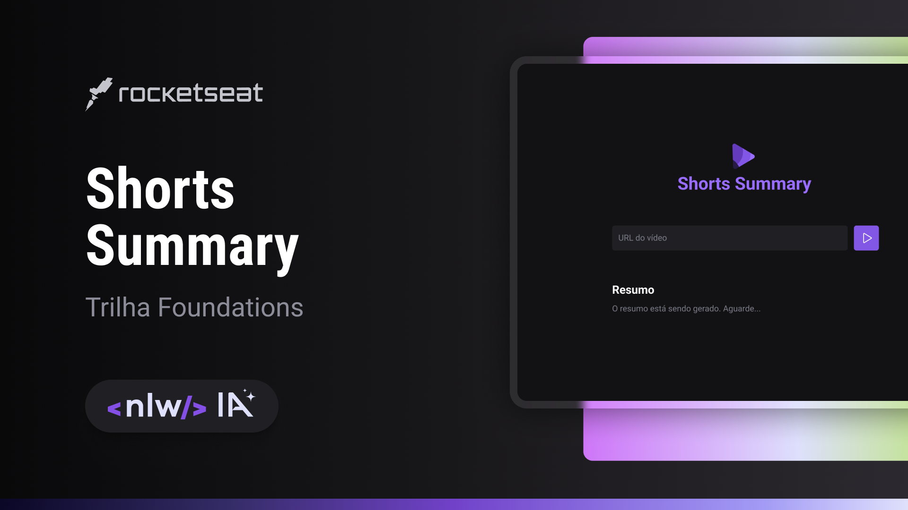

  

## 💻 Shorts-Summary

Esse é um projeto utilizando IA para fazer um resumo de um Shorts do Youtube.

## 🚀 Tecnologias

Esse projeto foi desenvolvido durante o NLW IA da Rocketseat com as seguintes tecnologias:

- HTML
- CSS
- JavaScript
- Node.js
- IA

## 🏷️ Layout

Você pode visualizar o layout do projeto através [desse link](https://www.figma.com/community/file/1282823495335498952).
É necessário ter uma conta no [Figma](https://www.figma.com)
